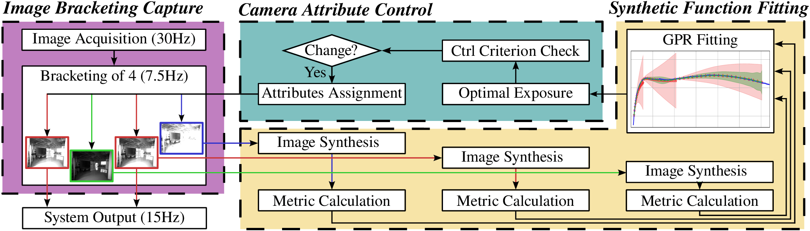
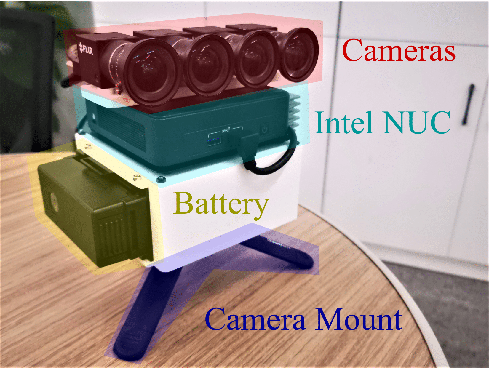
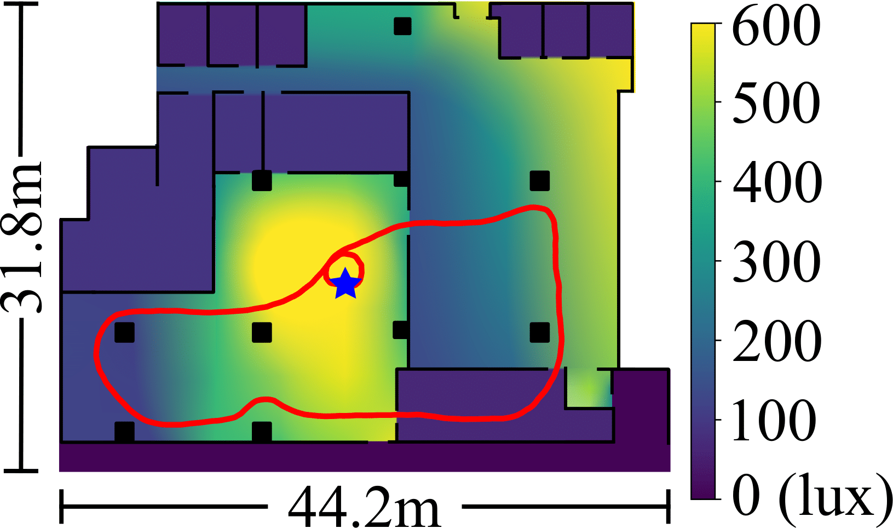
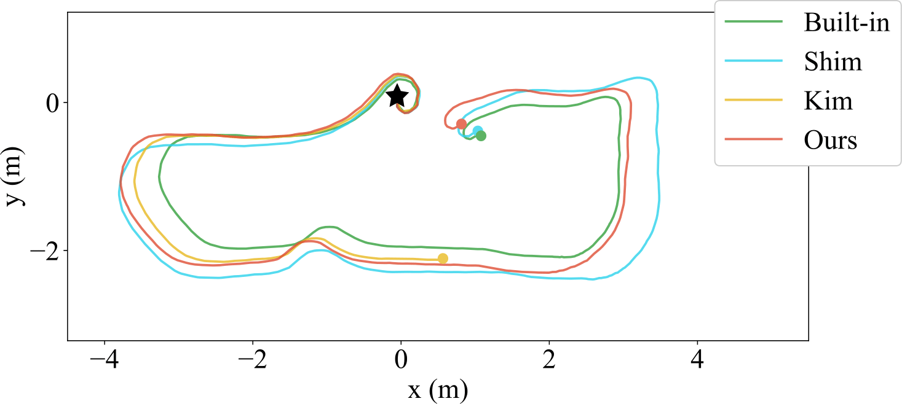
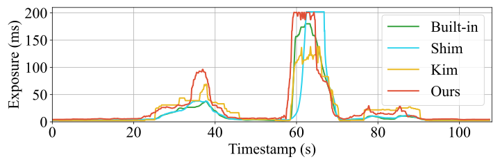
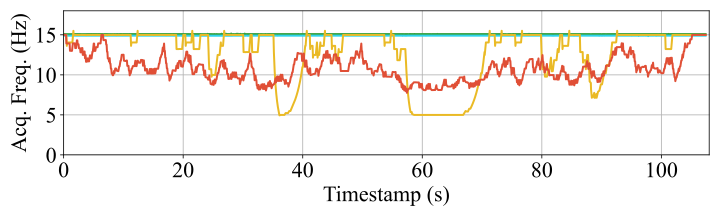
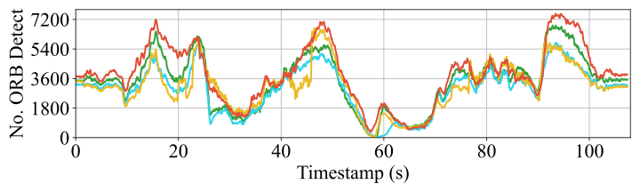
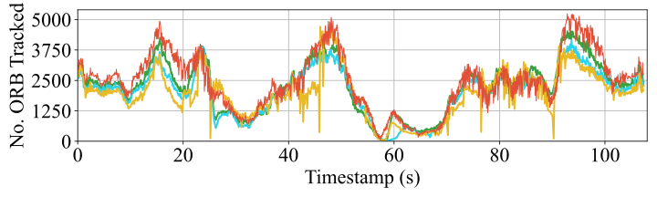
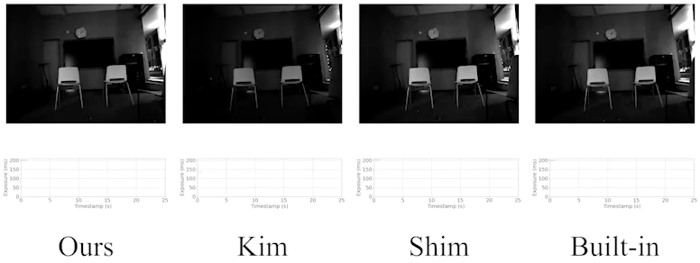
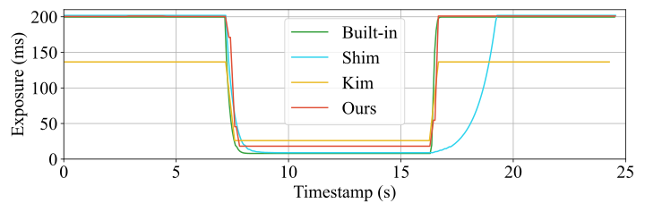

<!--
 * @Author: Shuyang Zhang
 * @Date: 2024-02-29 17:04:28
 * @LastEditors: ShuyangUni shuyang.zhang1995@gmail.com
 * @LastEditTime: 2024-03-02 21:50:22
 * @Description: 
 * 
 * Copyright (c) 2024 by Shuyang Zhang, All Rights Reserved. 
-->
# HDR Bracketing Camera Attribute Control

This is an official repository of

**An Image Acquisition Scheme for Visual Odometry based on Image Bracketing and Online Attribute Control**, Shuyang Zhang, Jinhao He, Bohuan Xue, Jin Wu, Pengyu Yin, Jianhao Jiao and Ming Liu.

This paper will be officially released on IEEE International Conference on Robotics and Automation (ICRA) 2024.

<p align="center">
  
</p>
<p align="center">
  <strong> System Overview </strong>
</p>

## Highlights
* A camera attribute control method adapted to image bracketing patterns. Images with various exposures are captured for scene exploration, and optimal exposure for the next control is globally optimized by Gaussian process regression (GPR).
* A VO-oriented image acquisition scheme that explores a wide dynamic range and provides stable image sequences in the time domain. The system leverages the exploration of the dynamic range with system output frequency according to the bracketing pattern design.

<p align="center">
  
</p>
<p align="center">
  <strong> Image Bracketing Pattern (Bracket of 4) </strong>
</p>

## Basic Information
* This work focus on the camera attribute control task. The attributes that we focus on include the **exposure time** and the **analog gain**.
* Since this work needs an interaction with the camera device (to control the camera's attributes), we need a camera entity with **image bracketing interface**. We use the [FLIR BFS cameras](https://www.flir.com/products/blackfly-s-usb3/?vertical=machine%20vision&segment=iis) (FLIR BFS-U3-31S4C) and the bracketing images are captured by the Sequencer within the [Spinnaker API](https://www.flir.com/products/spinnaker-sdk/?vertical=machine+vision&segment=iis).
* We implement our method alongside several baseline methods. For real-time usage, we package them as a ROS node which can be considered as a camera driver.
  * If you have a suitable FLIR BFS camera, you can follow the Getting Start to run this driver directly on your FLIR BFS device.
  * If you have a suitable camera device with image bracketing interface but not FLIR with Spinnaker API, you can follow [the guide](docs/code_structure.md) to extract our method from the code and reimplement it on your own platforms.

## Requirements
### Hardware
* Cameras with Image Bracketing Interface (recommended [FLIR BFS cameras](https://www.flir.com/products/blackfly-s-usb3/?vertical=machine%20vision&segment=iis))

### Software
* Ubuntu (20.04)
* [ROS (Noetic Ninjemys)](https://wiki.ros.org/noetic/Installation/Ubuntu)
* OpenCV (installed with ROS)
* Eigen (installed with ROS)
* [Spinnaker (2.7.0.128)](https://www.flir.com/products/spinnaker-sdk/)
* [YAML-CPP](https://github.com/jbeder/yaml-cpp)

## Getting Start
1. Install [ROS (Noetic Ninjemys)](https://wiki.ros.org/noetic/Installation/Ubuntu)
2. Install [Spinnaker](https://www.flir.com/products/spinnaker-sdk/)
3. Generate ROS workspace 
```
mkdir ${Workspace_PATH}\src
```
4. Pull this repository with 3rdparty modules
```
cd ${Workspace_PATH}\src
# use '--recursive' to add 3rdparty modules
git clone git@github.com:ShuyangUni/hdr_bracketing_cam_ctrl.git --recursive
```
5. Compile this repository
```
cd ${Workspace_PATH}
catkin_make
```
6. Set YAML parameters following [this guide](docs/parameter_configuration.md)
7. To run our method, the Camera Response Function (CRF) of the camera needs to be calibrated, please follow [this guide](docs/photometric_calibration.md)
8. Run the code
```
source devel/setup.bash
# change the launch file to your config file
roslaunch hdr_attr_ctrl test_camera_auto.launch
```

## Experiment Results
### Platform
<p align="center">
  
</p>
<p align="center">
  <strong> Our Platform (4 FLIR BFS-U3-31S4C cameras and 1 Intel NUC11TNKi7) </strong>
</p>

### Visual Odometry
<p align="center">
   
</p>
<p align="center">
  
</p>
<p align="center">
   
   
</p>

### Drastic Luminance Change
<p align="center">
  
</p>
<p align="center">
  
</p>